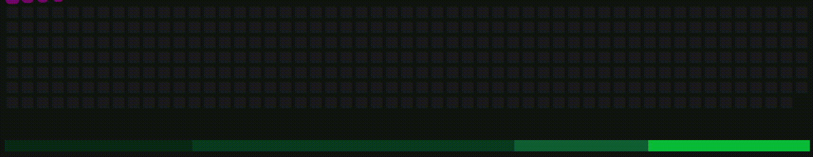

###

  

  <h3 align="left">Languages and technologies:</h3>
  
  
  
  
  
  
  
  
  
  
  
  
  
  
  
  
  
  
  
  
  
  
  
  
  
  
  
  
  
  
  
  
  
  
  
  
  
  

###

<h3 align="left">Connect with me:</h3>

###

###

<h3 align="center">Greetings! I'm a dedicated full-stack web developer with a fervent passion for learning and delving into cutting-edge technologies. My forte lies in crafting seamless and dynamic web experiences that make a memorable impression.  I find immense satisfaction in tackling complex challenges and turning them into elegant, user-friendly solutions. With a keen eye for detail and a penchant for creativity, I strive to bring innovation to every project I undertake.  Let's embark on this journey of innovation and discovery together!</h3>

###

&nbsp;

